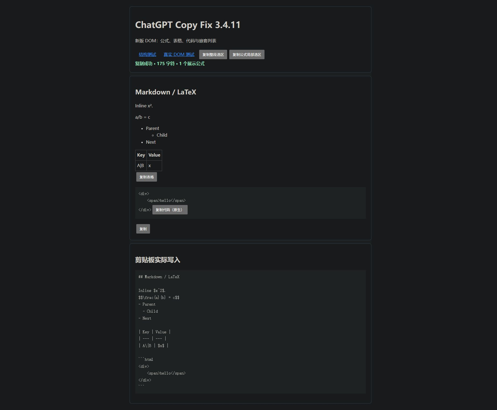

# ChatGPT Copy Fix 3.4.11 verification

Verified 2026-09-27 on Windows with Node 24.14.1 and the user's Chrome browser.

## Reproduction and fix

The user's pasted 3.4.10 script did not intercept the copy button in the current ChatGPT DOM. Its selectors depended on a removed button test ID, message roles and `.markdown`.

An isolated replay of the same captured turn changed from `intercepted=false` with the original script to `intercepted=true` with 3.4.11. The result contains 1,906 characters and all 35 source formulas, including 20 single-line display blocks. The captured conversation and copied Markdown were kept only in the task's temporary directory and removed after verification.

## Automated checks

`tools/validate.ps1` passed: 16 ChatGPT copy regression tests, 4 existing sync-core tests, syntax checks and the repository's existing publication checks.

Tests cover the current renderer, legacy DOM, multiple assistant segments, turn isolation, English labels, empty replies, plain-text selection, partial formula selection, MathML annotations, tables, native code buttons, editable selections, literal HTML in code, indentation, clipboard fallback focus and consecutive-copy races.

## Chrome clipboard acceptance

The final userscript was loaded as a normal script in a loopback HTTP fixture. Assertions read the actual Chrome clipboard after UI actions:

| Action | Result |
| --- | --- |
| Reply copy button | Exact expected Markdown, with formula delimiters, table and indented code |
| Reply copy button activated with Enter | Same expected Markdown |
| Table copy button | Exact Markdown table with escaped pipe and inline math |
| Full reply selected, real Ctrl+C | Same expected Markdown; clipboard only `text/plain` |
| One glyph selected, real Ctrl+C | Full `$$\frac{a}{b} = c$$`; clipboard only `text/plain` |
| Captured current ChatGPT turn, copy button | 35/35 formulas retained; 20 compact display blocks |

## Remaining installation boundary

The browser tool blocks extension URLs, so the installed Tampermonkey editor and live userscript execution were not changed or verified. Install/update the published userscript and refresh ChatGPT. The user's original clipboard was restored after testing.
